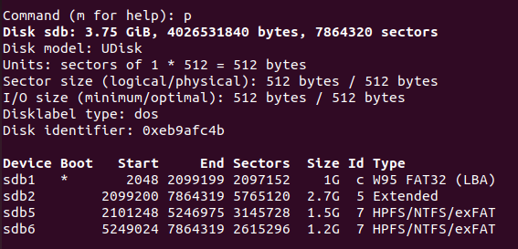
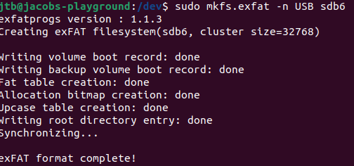
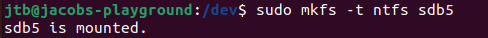
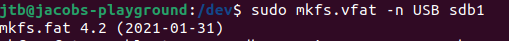

# OS_LAB_2 -> Jacob Barnum
Lab writeup for Operating Systems (Lab 2)

## Partition Table:

## EXFAT file system:

## NTFS file system:

## VFAT file system:

## Booting ESXI:
I left my USB with you for testing. You just told me to include in my writeup that I was waiting on you to test it.
